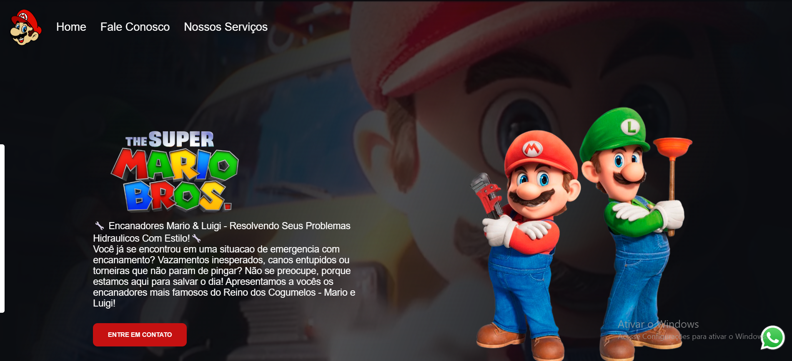
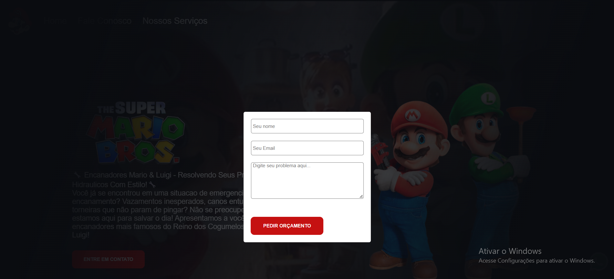

# 🍄 Projeto Mario Bros - Landing Page de Serviços

Este projeto é uma landing page temática inspirada no universo de Super Mario Bros, desenvolvida para divulgar serviços de encanamento de forma criativa, visual e interativa.

A proposta foi criar uma página moderna e responsiva utilizando apenas tecnologias fundamentais do Front-End: HTML, CSS e JavaScript puro.

---

## 🚀 Tecnologias Utilizadas

- HTML5
- CSS3
- JavaScript
- Formcarry (envio de formulário)
- WhatsApp API

---

## 🎯 Funcionalidades

✅ Layout responsivo e visual atrente  
✅ Vídeo de fundo em autoplay  
✅ Botão flutuante para contato via WhatsApp  
✅ Formulário de orçamento com efeito modal  
✅ Máscara de fundo ao abrir formulário  
✅ Interface inspirada no universo Mario Bros

---

## 📸 Preview do Projeto

### Tela Inicial



### Formulário de Contato



---

## 💡 Objetivo do Projeto

Este projeto foi desenvolvido com foco em prática de Front-End, manipulação de DOM e construção de interfaces mais profissionais para portfólio.

Além da parte visual, o objetivo foi treinar:

- Estruturação semântica com HTML
- Estilização avançada com CSS
- Interatividade com JavaScript
- Integração com serviços externos

---

## 📂 Como Executar

Clone o repositório:

```bash
git clone https://github.com/seuusuario/projeto-mario.git
